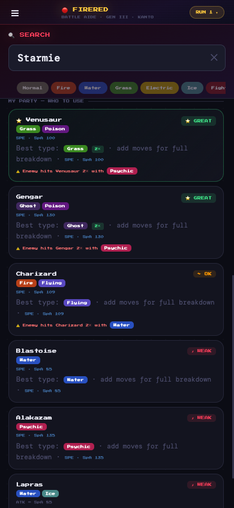
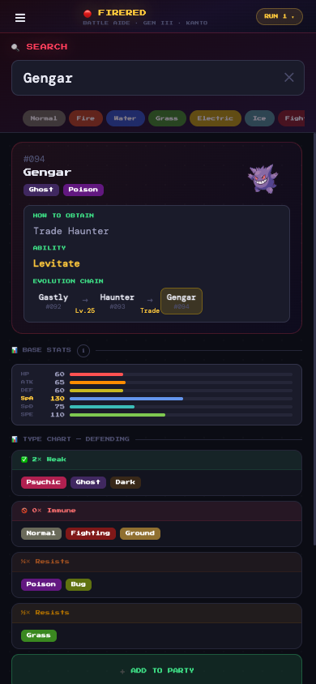
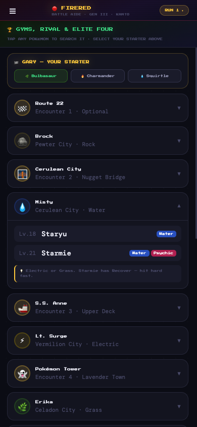
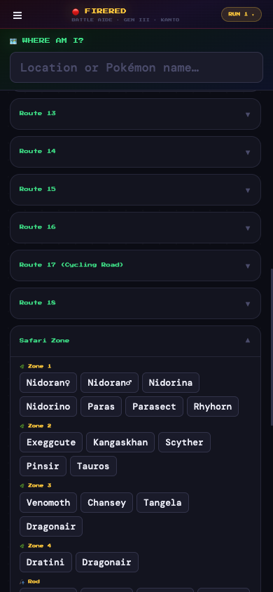

# Super Effective — Pokémon FireRed & LeafGreen Companion

Your complete companion for FireRed & LeafGreen.

**[Check it out →](https://ethanlookpotts.github.io/super-effective/)**

---

### Build the perfect party

Catch Pokémon to your PC Box, get smart suggestions that maximise type coverage, and see at a glance exactly which party members to use against any opponent.

---

### Look up any Pokémon instantly

Type matchups, base stats, ability, obtain method, and evolution chain — everything you need before the next turn.

---

### Scout every boss before you walk in

Full teams with levels, types, and tactical tips for every gym leader, rival encounter, and Elite Four member.

---

### Find what's in your area

Browse wild encounters by location. Tap any Pokémon to look it up.

